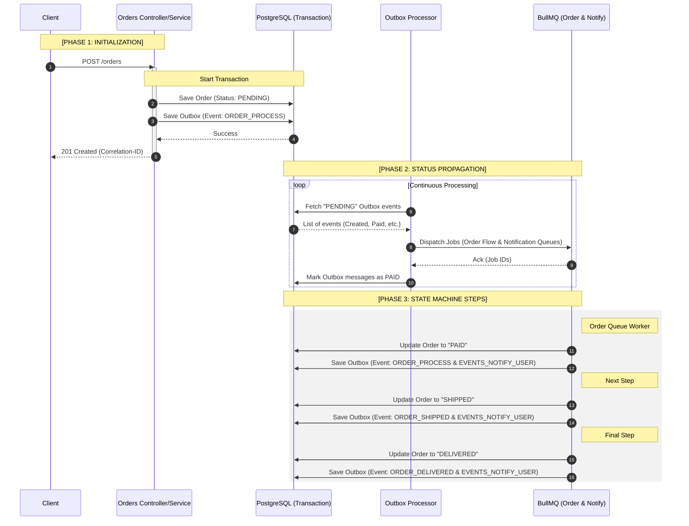

# Order Flow API


---

## Overview

I built this Order Management API with NestJS to show my approach to backend architecture, specifically focusing on asynchronous processing and event-driven design.

Instead of writing a simple CRUD app, I wanted to simulate a messy, real-world order lifecycle where performance, resilience, and knowing exactly what failed actually matter.

---

## Why I built this

Most backend systems eventually hit the same problems:

- Processing things asynchronously without losing data
- Decoupling logic so parts of the app can scale
- Tracking down a bug across multiple distributed flows
- Retrying failed jobs safely without duplicating records

It's common to reach for microservices to solve these, but that brings a lot of operational baggage. I wanted to see how far I could push these patterns **while keeping the monolith**.

---

## Quick start

**Prerequisites**

Before starting, make sure you have the following installed:

- **Docker & Docker Compose**: To orchestrate the containers.
- **Git**: To clone the repository.

**Getting Started**

**1.** Clone the repository:

```bash
git clone https://github.com/bside89/order-flow-api
cd order-flow-api
```

**2.** Run the installation script:

```bash
chmod +x install.sh && ./install.sh
```

This script will automatically create your `.env` file from the example and start the services using `docker-compose up --build`.

> **Note:** If you prefer to run manually, ensure you copy `.env.example` to `.env.docker` before running `docker-compose up --build`.

> **Stripe tip:** Set `STRIPE_TEST_MODE` to `local`, `docker`, or `live` depending on how you want to test payments. The details are in the Stripe testing section below.

**3.** Access:

API: http://localhost:3000

Bull Board: http://localhost:3000/bull-board

Grafana: http://localhost:3001

When `APP_ENV` is different from `production`, the app creates a mock admin user on startup if it does not already exist:

- Name: João Silva Admin
- Email: joao.silva@email.com
- Password: password123
- Role: admin

This user is meant for local and development testing only. In `production`, it is not created.

---

## Architecture overview

```
Client → API (NestJS)
        ↓
     Orders Module
        ↓
     BullMQ Queue
        ↓
     Workers (Strategies)
        ↓
     Event Bus
        ↓
     Notifications / Side Effects
```

---

## Architecture highlights

- **Event-driven within a monolith**  
  You get the decoupling benefits without the headache of managing multiple deployments.

- **Queue-based processing (BullMQ)**  
  I used BullMQ to handle retries and backoff strategies, making the system way more resilient.

- **Strategy + Factory patterns**  
  Keeps the workflow handling flexible. It's easy to plug in a new strategy without breaking existing code.

- **Idempotent job execution**  
  Because retrying a failed payment twice by accident is a developer's worst nightmare.

- **Centralized logging with correlationId**  
  I added this so I could actually trace an async request from start to finish.

- **High-throughput outbox processor**  
  Uses Recursive Polling to process events in batches — throughput stays high without blocking the Event Loop.

- **Database concurrency control**  
  Uses `SELECT ... FOR UPDATE SKIP LOCKED` so multiple outbox instances can run in parallel without stepping on each other.

---

## Performance and scalability

I ran k6 stress tests to find performance bottlenecks.

### Concurrency tuning

The two queues have different I/O profiles, so they get different concurrency limits:

| Queue      | Concurrency | Strategy                                                                                                |
| :--------- | :---------- | :------------------------------------------------------------------------------------------------------ |
| **Orders** | `15`        | Capped to protect the PostgreSQL connection pool during complex transactions.                           |
| **Events** | `30`        | Higher because these are fast external I/O calls — notifications don't need the same care as DB writes. |

### Throughput benchmarks

Switching to batch processing cut Outbox latency. Load tests at 100+ concurrent orders came back clean — no lost events, no noticeable lag on state updates.

---

## Order processing flow

1. Order is created via API
2. Job is added to queue
3. Worker processes using strategy
4. Events are emitted
5. Side effects are triggered (notifications, logs)

Here is a diagram showing the big picture:



---

## Observability and monitoring

- Structured logging with Pino (JSON)
- Correlation ID for end-to-end tracing
- Log aggregation via Promtail + Loki
- Visualization with Grafana
- Track a single order across multiple async steps
- Debug failures in distributed flows

---

## Testing strategy

- **Integration testing (Testcontainers):** Spins up real PostgreSQL and Redis instances per test run. No mocked databases, no "works on my machine" surprises.

- **Load testing (k6):** Hammers the queue under concurrent load to confirm jobs don't get processed twice when retries kick in.

## Stripe testing

Stripe behavior is controlled by `STRIPE_TEST_MODE`.

- `local`: starts `stripe-mock` in Docker and points the app to `localhost:12111`. Use this when you run the API on your machine.
- `docker`: starts `stripe-mock` in Docker and points the app to `stripe-mock:12111`. Use this when the whole stack runs inside Docker.
- `live`: talks to Stripe's test environment. You need to put your own Stripe test secret key in `.env`.

The integration and E2E tests mock `PaymentsService`, so they do not depend on Stripe at all. If you want to test real Stripe behavior, switch to `live`. If you just want the app to run without external calls, keep `local` or `docker`.

---

## Features

- Order creation and lifecycle processing
- Multi-stage async pipeline (process → ship → deliver)
- Job chaining and orchestration
- Decoupled notification system
- Idempotency for jobs and events
- Authentication with multi-device support
- Refresh token hashing
- Secure logout (session invalidation)

---

## Engineering trade-offs

| Decision                    | Reason                                |
| --------------------------- | ------------------------------------- |
| Monolith over Microservices | Reduced operational complexity        |
| BullMQ over Kafka           | Simpler setup, sufficient for scale   |
| Partial Event-Driven        | Applied only where it adds real value |

---

## Tech Stack

- NestJS
- BullMQ + Redis
- PostgreSQL
- Docker
- Grafana + Loki + Promtail
- Pino Logger

---

## Production considerations

This project includes patterns commonly used in production systems:

- Retry strategies with backoff
- Failure isolation via queues
- Observability-first design
- Scalable processing pipelines
- Transactions

---

## What this demonstrates

- Real-world backend architecture
- Clean code and separation of concerns
- Practical use of design patterns
- Async workflows and resilience
- Monitoring and debugging strategies

---

## Final thoughts

I built this codebase primarily to experiment with tools and patterns I use in production setups. Feel free to explore the code, and if you spot any areas to push the architecture even further, let me know.
