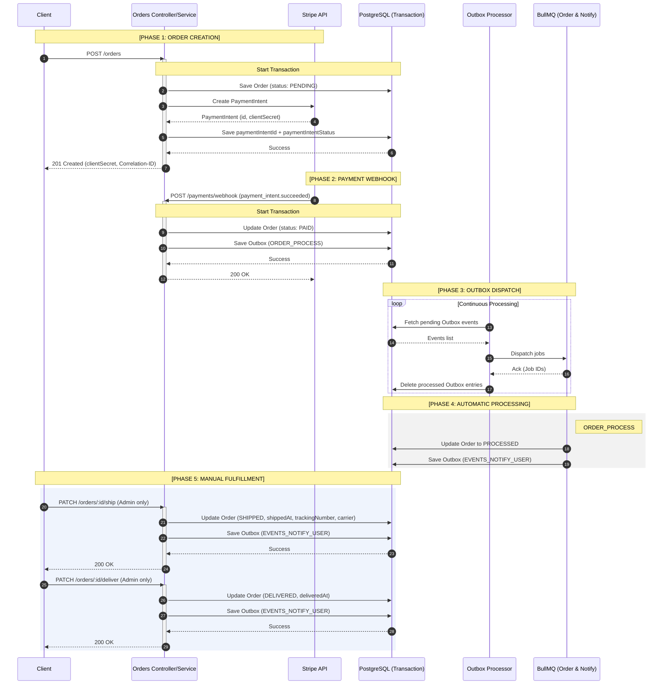

# Dispatch


---

## Overview

Dispatch is an order management API built with NestJS. I built it to work through the architectural problems that come up in real e-commerce backends: async processing, distributed locking, transactional guarantees, and a fulfillment model that actually reflects how warehouses work.

The flow is hybrid. Payment processing and compensation (cancel, refund) run through BullMQ queues — they need retries and backoff. Shipping and delivery are manual admin endpoints, because those depend on someone at a warehouse making a decision, not a timer firing automatically.

---

## Why I built this

Most backend systems eventually hit the same problems:

- Processing things asynchronously without losing data
- Decoupling logic so parts of the app can scale
- Tracking down a bug across multiple distributed flows
- Retrying failed jobs safely without duplicating records

The instinct is to reach for microservices to solve these, but that brings a lot of operational baggage. I wanted to see how far I could push these patterns while keeping the monolith.

---

## Quick start

**Prerequisites**

Before starting, make sure you have the following installed:

- **Docker & Docker Compose**: To orchestrate the containers.
- **Git**: To clone the repository.

**Getting Started**

**1.** Clone the repository:

```bash
git clone https://github.com/bside89/dispatch-api
cd dispatch-api
```

**2.** Run the installation script:

```bash
chmod +x install.sh && ./install.sh
```

This script will automatically create your `.env` file from the example and start the services using `docker-compose up --build`.

> **Note:** If you prefer to run manually, ensure you copy `.env.example` to `.env.docker` before running `docker-compose up --build`.

> **Stripe tip:** Set `STRIPE_TEST_MODE` to `local`, `docker`, or `live` depending on how you want to test payments. The details are in the Stripe testing section below.

**3.** Access:

API: http://localhost:3000

Bull Board: http://localhost:3000/bull-board

Grafana: http://localhost:3001

When `APP_ENV` is different from `production`, the app creates a mock admin user on startup if it does not already exist:

- Name: João Silva Admin
- Email: joao.silva@email.com
- Password: password123
- Role: admin

This user is meant for local and development testing only. In `production`, it is not created.

---

## Architecture overview

```
Client → API (NestJS)
        ↓
     Orders Module
        ↓
     BullMQ Queue
        ↓
     Workers (Strategies)
        ↓
     Event Bus
        ↓
     Notifications / Side Effects
```

---

## Architecture highlights

- **Event-driven within a monolith**  
  Orders, payments, notifications, and side effects communicate through an internal event bus. No service discovery, no shared network. Less operational overhead; the tradeoff is that module boundaries have to be maintained by convention.

- **Queue-based processing (BullMQ)**  
  Payment processing and order compensation run through BullMQ with exponential backoff. If the process job fails, it retries up to 3 times before triggering the compensation flow.

- **Hybrid fulfillment model**  
  PROCESS, CANCEL, and REFUND go through BullMQ because they need retries. SHIP and DELIVER are synchronous endpoints an admin calls when the warehouse is actually ready — no queue, no scheduler.

- **Strategy + Factory patterns**  
  Each order job type (PROCESS, CANCEL, REFUND) has a dedicated strategy class. Adding a new job type means adding one class — the processor and factory stay untouched.

- **Idempotent job execution**  
  Jobs carry the order ID and target status in their payload. Before executing, the strategy re-reads the database and validates the precondition. A PAID → PROCESSED job running twice gets blocked on the second run.

- **Centralized logging with correlationId**  
  Every request gets a correlation ID injected at the middleware level. Async jobs carry it forward so you can trace a single order across all log lines, even across queue hops.

- **High-throughput outbox processor**  
  Uses recursive polling with `setImmediate` between batches to yield back to the event loop. A spike in queued events doesn't starve other requests.

- **Database concurrency control**  
  Uses `SELECT ... FOR UPDATE SKIP LOCKED` on outbox reads, so multiple processor instances can run against the same database without double-dispatching events.

---

## Performance and scalability

I ran k6 stress tests to find performance bottlenecks.

### Concurrency tuning

The two queues have different I/O profiles, so they get different concurrency limits:

| Queue      | Concurrency | Strategy                                                                                                |
| :--------- | :---------- | :------------------------------------------------------------------------------------------------------ |
| **Orders** | `15`        | Capped to protect the PostgreSQL connection pool during complex transactions.                           |
| **Events** | `30`        | Higher because these are fast external I/O calls — notifications don't need the same care as DB writes. |

### Throughput benchmarks

Switching to batch processing cut Outbox latency. Load tests at 100+ concurrent orders came back clean — no lost events, no noticeable lag on state updates.

---

## Order processing flow

1. Client creates an order — Stripe PaymentIntent is created, order sits at PENDING
2. Stripe fires a webhook when the payment settles
3. On success: order moves to PAID, ORDER_PROCESS is added to the outbox
4. Outbox processor dispatches ORDER_PROCESS to BullMQ
5. ORDER_PROCESS worker runs automatically: PAID → PROCESSED
6. Admin ships the order: `PATCH /orders/:id/ship` → PROCESSED → SHIPPED (accepts optional `trackingNumber` and `carrier`)
7. Admin confirms delivery: `PATCH /orders/:id/deliver` → SHIPPED → DELIVERED
8. Admin can cancel pre-shipment: `PATCH /orders/:id/cancel` — ORDER_CANCEL is enqueued, stock is restored, order ends at CANCELLED
9. Admin can trigger a refund: `PATCH /orders/:id/refund` — ORDER_REFUND is enqueued, Stripe processes the refund
10. On payment failure: ORDER_CANCEL is enqueued automatically — same cancel and restore logic applies

The sequence diagram:



---

## Observability and monitoring

- Structured logging with Pino (JSON)
- Correlation ID for end-to-end tracing
- Log aggregation via Promtail + Loki
- Visualization with Grafana

---

## Testing strategy

Integration tests spin up real PostgreSQL and Redis containers via Testcontainers. No mocked databases, no "works on my machine" surprises.

There's also a k6 load test that hammers the queue under concurrent load to confirm jobs don't get processed twice when retries kick in.

---

## Stripe testing

Stripe behavior is controlled by `STRIPE_TEST_MODE`.

- `local`: starts `stripe-mock` in Docker and points the app to `localhost:12111`. Use this when you run the API on your machine.
- `docker`: starts `stripe-mock` in Docker and points the app to `stripe-mock:12111`. Use this when the whole stack runs inside Docker.
- `live`: talks to Stripe's test environment. You need to put your own Stripe test secret key in `.env`.

The integration and E2E tests mock `PaymentsService`, so they do not depend on Stripe at all. If you want to test real Stripe behavior, switch to `live`. If you just want the app to run without external calls, keep `local` or `docker`.

---

## Features

- Order creation and lifecycle management
- Hybrid order pipeline: BullMQ for automatic processing, admin endpoints for manual fulfillment
- Decoupled notification system
- Idempotency for jobs and events
- Authentication with multi-device support
- Refresh token hashing
- Secure logout (session invalidation)

---

## Engineering trade-offs

| Decision                    | Reason                                                                                                                                                                                                 |
| --------------------------- | ------------------------------------------------------------------------------------------------------------------------------------------------------------------------------------------------------ |
| Monolith over Microservices | No service discovery, no cross-service network calls, no distributed tracing setup. The constraints are worth it for a project at this scale.                                                          |
| BullMQ over Kafka           | Kafka's strength is ordered, partitioned streams across consumer groups. BullMQ with Redis covers the actual requirements: reliable retries, per-queue concurrency caps, and rate limiting.            |
| Partial event-driven        | Only order processing and notifications go through the event bus. Auth and user management are plain request/response — adding async complexity there would solve a problem this project doesn't have. |

---

## Production considerations

A few things that would matter in a real deployment:

The outbox pattern gives at-least-once delivery guarantees. Events are written to the database in the same transaction as the state change, so a crash between "state updated" and "event dispatched" can't lose the event. Duplicate dispatch is prevented by idempotency checks at the job level.

Distributed locking via Redlock ensures concurrent webhook deliveries for the same order don't cause split-brain state. The lock covers the full transaction.

BullMQ retries with exponential backoff handle transient failures. Jobs that exhaust all retries get logged with full context so failures are traceable.

---

## What's worth looking at

A few things in this codebase that aren't obvious from the feature list:

The outbox processor (`shared/modules/outbox/`) uses a recursive `setImmediate` loop to drain event batches without blocking the event loop. Under load, it batches aggressively while still yielding between iterations.

The hybrid fulfillment model required splitting what was originally a fully automatic queue pipeline. `ORDER_STATUS_PRECONDITIONS` in `orders/constants/` enforces valid state transitions for both the BullMQ strategies and the direct service calls — single source of truth for the state machine.

The integration tests (`test/orders.int-spec.ts`) run the actual outbox processor against real PostgreSQL and Redis containers via Testcontainers. Timing bugs, lock contention, and idempotency issues show up in tests, not in production. That's the point.

---

## Final thoughts

I built this to work through patterns I reach for in production — the outbox, distributed locking, hybrid sync/async flows. It's a portfolio project, but the problems it's solving are real.
